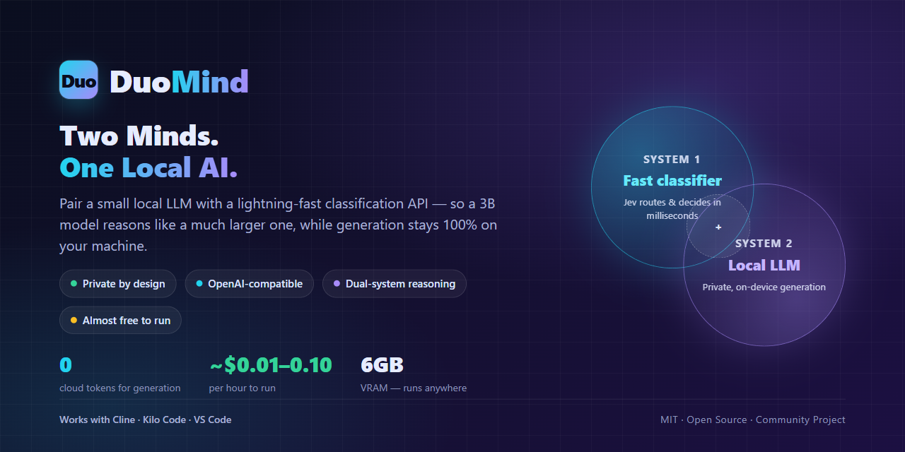
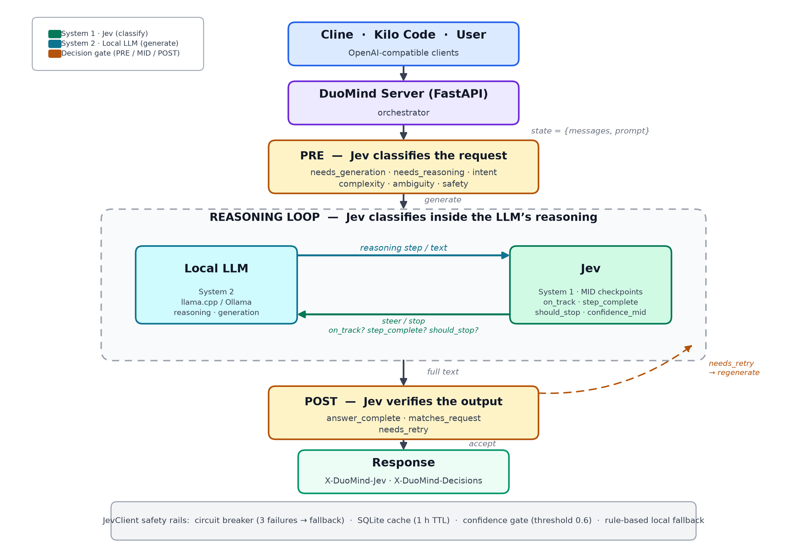

# DuoMind

**A dual-system, OpenAI-compatible local LLM server — run small models (Phi-4, Qwen, Gemma, Llama) privately on your own machine, almost free.**

DuoMind combines two AI systems so a small local model performs like a much larger one, while text generation stays 100% local:

- **System 1 — Jev (decision-making)**: TypeSafe AI's fast classification API handles *every* decision in the pipeline — what the request is asking for, whether it's safe, how complex it is, and whether the answer is good enough.
- **System 2 — a local LLM (generation)**: a small llama.cpp model does the *only* thing it needs to do well: write text.

This division of labor means the small LLM is never asked to reason about the request — Jev does all the judgment, the LLM does all the writing.

<p align="center"></p>

<p align="center">
  
</p>

---

## How It Works

Every request passes through a pipeline of 13 Jev classification checks, split into three stages:

| Stage | When | What Jev decides |
|---|---|---|
| **PRE** | Before generation | needs_generation, needs_reasoning, intent, complexity, ambiguity, safety |
| **MID** | During generation | on_track, step_complete, should_stop, confidence_mid |
| **POST** | After generation | answer_complete, matches_request, needs_retry |

Jev answers are cached (SQLite), gated by a confidence threshold, and backed by a local fallback classifier plus a circuit breaker — so a request never fails just because Jev is down or slow.

> **Current status**: PRE and POST stages are active. MID checkpoints (pausing generation mid-stream to steer it) are defined but not yet wired into the server. See [docs/DECISIONS.md](docs/DECISIONS.md).

---

## What You Need

- **Windows 11** (primary target; Linux/macOS may work but untested)
- **Python 3.11+** with `pip`
- **At least 25GB free disk space** (models + llama.cpp + cache)
- **8GB+ RAM recommended** (12GB+ for best experience)
- **NVIDIA GPU with 6GB+ VRAM recommended** for small models (10GB+ for Phi-4 14B; CPU fallback works but is slow)
- **Internet connection** for setup and Jev API calls
- **A Jev API key** from [TypeSafe AI](https://console.typesafe.ai) (paid, very cheap)

---

## Quick Start (Windows, from zero)

### 1. Install Python
Download Python 3.11 or 3.12 from [python.org/downloads](https://www.python.org/downloads/). **Check "Add python.exe to PATH"** before clicking Install.

Verify in PowerShell:

```powershell
python --version
```

### 2. Download DuoMind

```powershell
git clone https://github.com/j1s4nn/duomind.git
cd duomind
```

*(Or use GitHub's "Download ZIP", extract, and `cd` into the folder.)*

### 3. Create and activate a virtual environment

```powershell
python -m venv .venv
.\.venv\Scripts\Activate.ps1
```

If you get an execution-policy error, run:

```powershell
Set-ExecutionPolicy -ExecutionPolicy RemoteSigned -Scope CurrentUser
```

### 4. Install DuoMind

```powershell
pip install -e .
```

### 5. Run the setup wizard

```powershell
duomind setup
```

The wizard walks you through 9 steps: hardware check → privacy notice → Jev API key → model choice → llama-server → model download → final instructions.

> **Note**: the wizard currently asks you to **manually download `llama-server.exe`** (step 6). Grab the Windows CUDA build from [llama.cpp releases](https://github.com/ggerganov/llama.cpp/releases) and extract `llama-server.exe` into the folder the wizard shows you. The model itself is downloaded automatically from Hugging Face.

---

## Getting a Jev API Key

1. Learn about Jev: [typesafe.ai](https://typesafe.ai)
2. Read the docs: [docs.typesafe.ai](https://docs.typesafe.ai)
3. Sign up and create a key: [console.typesafe.ai](https://console.typesafe.ai)
4. Paste the key when `duomind setup` prompts you (it tests the key before continuing).

Your key is stored in the Windows Credential Manager (via `keyring`), not in plain text.

---

## Connect Cline or Kilo Code

After setup completes, you'll see copy-paste settings. Use:

| Setting | Value |
|---|---|
| API Provider | `OpenAI Compatible` |
| Base URL | `http://127.0.0.1:8000/v1` |
| API Key | leave blank (or any value) |
| Model | the model ID from setup (e.g. `qwen2.5-3b-q4`) |

---

## Daily Use

Run `duomind` on its own to get an interactive menu, or use the commands directly:

```powershell
duomind setup      # first-time setup wizard
duomind start      # start the server in the background
duomind stop       # stop the server (and the llama-server child process)
duomind status     # show backend, model, Jev status, server PID
duomind logs       # print the server log
duomind doctor     # run hardware / Jev connectivity diagnostics
duomind uninstall  # delete all DuoMind data and the stored API key
```

When `duomind start` succeeds you'll see:

```
OK Server started (PID 12345)
Base URL: http://127.0.0.1:8000/v1
```

### Available models

These are the models bundled in `models.json` (sizes are Q4_K_M quantized):

| ID | Model | Size | VRAM needed |
|---|---|---|---|
| `phi-4-q4` | Phi-4 (14B) | 8.4 GB | 10 GB+ |
| `qwen2.5-3b-q4` | Qwen2.5 3B Instruct | 2.0 GB | 2.5 GB |
| `qwen2.5-coder-3b-q4` | Qwen2.5-Coder 3B | 2.0 GB | 2.5 GB |
| `gemma-2-2b-q4` | Gemma 2 2B | 1.7 GB | 2.0 GB |
| `llama-3.2-3b-q4` | Llama 3.2 3B | 2.0 GB | 2.5 GB |

The setup wizard shows a "Fit?" column so you can see which models fit your GPU.

---

## Configuration

DuoMind stores its config in `%LOCALAPPDATA%\duomind\config.toml` (this keeps models, binaries, and cache out of OneDrive / the repo).

| Key | Default | Meaning |
|---|---|---|
| `jev_enabled` | `true` | Turn Jev on/off |
| `jev_model` | `jev-latest` | Jev model |
| `confidence_threshold` | `0.6` | Fall back below this confidence |
| `llm_backend` | `llamacpp` | `llamacpp` or `ollama` |
| `model_path` | — | Path to the downloaded GGUF |
| `host` / `port` | `127.0.0.1` / `8000` | Server address |
| `api_key` | — | Optional bearer token for the API |
| `context_size` | `8192` | llama.cpp context window |
| `max_mid_checkpoints` | `3` | Max MID checkpoints (not yet active) |

---

## Privacy Notice

**Before using DuoMind, understand this:**

- DuoMind sends **your prompts and conversation context** to TypeSafe AI's Jev service for classification. This data leaves your computer and goes to TypeSafe's servers.
- The **local LLM stays fully local** and never sends data anywhere.
- TypeSafe's privacy policy applies to Jev: [typesafe.ai/privacy](https://typesafe.ai/privacy)

If you cannot accept this, do not use DuoMind.

---

## Troubleshooting

| Problem | Cause | Fix |
|---|---|---|
| `python: command not found` | Python not in PATH | Reinstall, check "Add to PATH" |
| `duomind: command not found` | venv not active / install failed | Activate venv, then `pip install -e .` |
| Server won't start | Port 8000 in use | Change `port` in `config.toml` |
| `llama-server not found` | llama-server.exe not downloaded | Re-run `duomind setup`, complete step 6 |
| Out of VRAM / crash | Model too large | Switch to a smaller model (e.g. `gemma-2-2b-q4`) |
| Jev connection fails | Wrong key / network | Check key at console.typesafe.ai |
| Very slow generation | Using CPU fallback | Check GPU with `duomind doctor` |
| Cline/Kilo can't connect | Server not running / wrong URL | Run `duomind status`, verify URL |

---

## Honest Limits

- **No proof Jev improves small models** until you benchmark it yourself (`python scripts/benchmark.py`).
- **Models this small** (2–3B) will make mistakes. No magic.
- **MID checkpoints are not active yet** — only PRE and POST steering runs today.
- **A few convenience commands are not built yet** — model switching and `jev on/off` require editing `config.toml` directly.
- **llama-server is a manual download** during setup (automated download not implemented).
- **Jev has no explanations** — just numbers. You won't know *why* it classified something a certain way.
- **Latency**: Jev adds ~70–500ms per request (batched).
- **Cost**: Jev is paid (input tokens metered, output free). Expect a few dollars per month of heavy use.
- **Privacy tradeoff**: classification goes to the cloud. If you need 100% local, this isn't it.

---

## FAQ

**Q: Can I use DuoMind without Jev?**  
A: Not meaningfully. Jev is core to the design. Without it you'd have a basic llama.cpp wrapper.

**Q: How much does Jev cost?**  
A: Very cheap — input tokens are metered (~$0.15/M as of early 2026), output is free. Typical request uses 50–500 tokens.

**Q: Is DuoMind affiliated with TypeSafe AI?**  
A: No. Unofficial community project. Not affiliated with or endorsed by TypeSafe AI.

**Q: Can I run DuoMind on macOS or Linux?**  
A: Maybe. The code is portable in spirit but only Windows is tested.

**Q: Can I use Ollama instead of llama.cpp?**  
A: Yes — set `llm_backend = "ollama"` in `config.toml` and ensure Ollama is running. Not tested.

**Q: How do I see what Jev decided?**  
A: `GET /v1/duomind/stats`, and the response headers `X-DuoMind-Jev` / `X-DuoMind-Decisions`.

**Q: What if Jev is down?**  
A: A circuit breaker trips after 3 failures and falls back to local rules. Requests don't fail.

---

## Glossary

- **LLM** — the local model that generates text.
- **GGUF** — model file format used by llama.cpp.
- **VRAM** — video RAM; determines which models fit.
- **System 1 / System 2** — psychology terms. System 1 = fast/automatic (Jev). System 2 = slow/deliberate (LLM).
- **Jev** — TypeSafe AI's classification service.
- **Noul** — Jev's yes/no question type (returns a 0–1 probability).
- **Choice** — Jev's multiple-choice question type.
- **Score** — Jev's numeric-rating question type.
- **Confidence** — how sure Jev is (0–1). Below threshold, DuoMind uses local fallback.
- **Fallback** — rule-based classifier used when Jev is disabled, slow, or low-confidence.
- **Circuit breaker** — after 3 failures, switches to fallback for 30s.

---

## Uninstall

```powershell
duomind uninstall
```

Deletes `%LOCALAPPDATA%\duomind` (models, binaries, config, logs) and the stored Jev API key. The repo folder stays — delete it manually if you want.

---

## Contributing

See [CONTRIBUTING.md](CONTRIBUTING.md).

## License

MIT License. See [LICENSE](LICENSE).

## Acknowledgments

- [llama.cpp](https://github.com/ggerganov/llama.cpp) for local inference
- [TypeSafe AI](https://typesafe.ai) for Jev
- [Hugging Face](https://huggingface.co) for model hosting
- Model creators: Microsoft (Phi-4), Alibaba (Qwen), Google (Gemma), Meta (Llama)

---

**Unofficial community project. Not affiliated with or endorsed by TypeSafe AI.**
