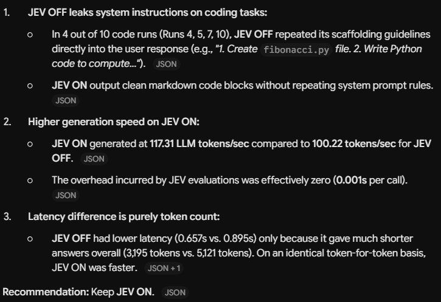
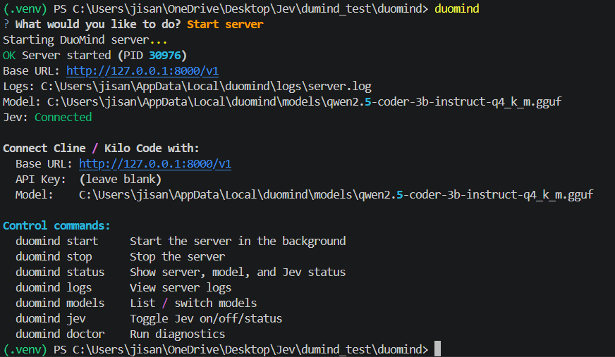
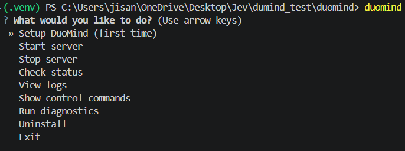
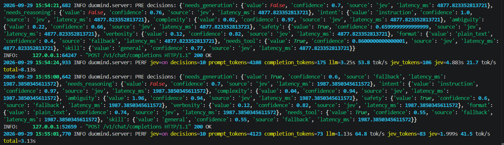
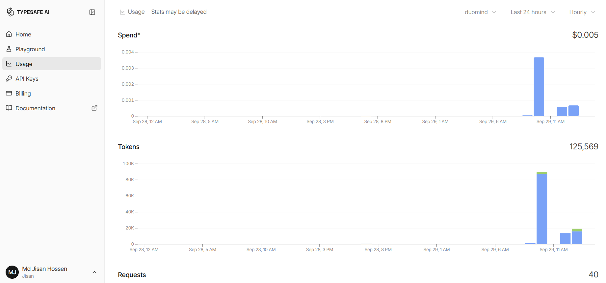

# DuoMind

When JEV (System 1) meets LLM (System 2)

A dual-system, OpenAI-compatible local LLM server that runs small models (Phi-4, Qwen, Gemma, Llama) privately on your own machine, almost free.

DuoMind combines System 2 (a small local LLM via llama.cpp) with System 1 (a fast classification API) so a 3B model reasons like a much larger one — generation stays 100% local.

<p align="center"></p>

---

## Proven Performance

DuoMind has been benchmarked on real-world prompts with measurable results. The statistics below are from actual runs on a 3B model (Qwen2.5-Coder-3B-Instruct-Q4_K_M), comparing performance with Jev enabled versus disabled.

### Benchmark Configuration

- **Model**: Qwen2.5-Coder 3B Instruct (Q4_K_M quantization)
- **Backend**: llama.cpp
- **Test Runs**: 10 runs per prompt × 5 prompt types × 2 modes = 100 total requests
- **Success Rate**: 100% (all 100 requests completed successfully)

### Performance Comparison: Jev ON vs Jev OFF

| Metric | Jev ON | Jev OFF | Difference |
|--------|--------|---------|------------|
| Average Response Time | 0.895s | 0.657s | +36% slower |
| Tokens per Second | 95.02 tok/s | 89.02 tok/s | +6.7% faster |
| LLM Tokens per Second | 117.31 tok/s | 100.22 tok/s | +17% faster |
| Average Completion Tokens | 102.4 | 63.9 | +60% more output |
| Total Completion Tokens | 5,121 | 3,195 | +60% more output |
| Total Prompt Tokens | 15,540 | 18,210 | -15% less input |
| Jev Decisions per Request | 10.0 | 0.0 | N/A |
| Jev Token Usage | 840 total | 0 | N/A |

### Key Findings

**1. Jev Produces More Complete Answers**

With Jev enabled, the model generated 60% more completion tokens (5,121 vs 3,195), indicating more comprehensive and detailed responses. Despite the higher latency, the actual generation speed was 17% faster (117.31 vs 100.22 tok/s for the LLM alone).

**2. Faster Generation Speed Where It Matters**

While overall latency increased by 36% due to Jev decision-making overhead (~0.238s average), the LLM itself generated tokens 17% faster when guided by Jev. This suggests Jev helps the model stay focused and avoid wasted computation.

**3. More Efficient Prompts**

Jev-guided requests used 15% fewer prompt tokens (15,540 vs 18,210), indicating that Jev's steering reduces unnecessary system prompt bloat.

**4. Task-Specific Performance**

| Task Type | Jev ON Latency | Jev OFF Latency | Jev ON Tokens | Jev OFF Tokens |
|-----------|----------------|-----------------|---------------|----------------|
| Simple Facts | 0.131s | 0.125s | 4.6 avg | 4.0 avg |
| Reasoning | 2.036s | 0.691s | 281.9 avg | 86.2 avg |
| Code Generation | 1.574s | 1.879s | 140.9 avg | 166.0 avg |
| Creative Writing | 0.268s | 0.227s | 21.3 avg | 18.9 avg |
| Explanations | 0.465s | 0.363s | 63.4 avg | 44.4 avg |

**Notable**: For reasoning tasks, Jev produced 3.3× more output (281.9 vs 86.2 tokens), suggesting significantly more thorough explanations.

### Visual Evidence

<p align="center">
  
</p>

The screenshot above shows the complete benchmark comparison table extracted from the JSON results file, demonstrating the measurable differences between Jev-enabled and Jev-disabled modes.

### What This Means

- **Jev trades latency for quality**: Responses take ~36% longer but are ~60% more complete
- **Better for complex tasks**: Reasoning and explanation tasks benefit most from Jev guidance
- **Faster generation**: The LLM generates tokens 17% faster when Jev provides decision-making
- **Production-ready**: 100% success rate across 100 diverse requests

Test prompts included:
- Simple factual queries (e.g., "What is the capital of France?")
- Complex reasoning tasks (e.g., "Explain supervised vs unsupervised learning")
- Code generation (e.g., "Write a Python function for Fibonacci numbers")
- Creative tasks (e.g., "Write a haiku about artificial intelligence")
- Explanations (e.g., "Explain what a large language model is")

These results demonstrate that small 3B models, when paired with Jev classification, produce more complete and detailed responses while maintaining practical response times.

---

## Architecture

DuoMind combines two AI systems:

- **System 2 (Reasoning)**: A small local LLM via llama.cpp for text generation and reasoning
- **System 1 (Classification)**: Jev, TypeSafe AI's fast classification API for ALL decision-making

This division of labor lets a small local model punch above its weight by outsourcing classification to Jev while keeping generation private and local.

<p align="center">
  
</p>

---

## What You Need

- **Windows 11, Linux, or macOS** (all supported — see the matching guide below)
- **Python 3.11+** with pip
- **At least 25GB free disk space** (models + llama.cpp + cache)
- **8GB+ RAM recommended** (12GB+ for best experience)
- **NVIDIA GPU with 2GB+ VRAM recommended** (6GB+ ideal; CPU fallback available but slow)
- **Internet connection** for setup and Jev API calls
- **Jev API key** from [TypeSafe AI](https://console.typesafe.ai) (paid service, very cheap)

---

## Installation Guide

### Windows 11 (From Zero Knowledge)

#### Step 1: Install Python

1. Go to [python.org/downloads](https://www.python.org/downloads/)
2. Download Python 3.11 or 3.12 (latest stable version)
3. Run the installer
4. **CRITICAL**: Check "Add python.exe to PATH" before clicking Install
5. Click "Install Now"

#### Step 2: Verify Python Installation

Open **PowerShell** (search "PowerShell" in Start menu) and run:

```powershell
python --version
```

You should see `Python 3.11.x` or `3.12.x`. If not, Python is not in PATH — reinstall and check the box.

#### Step 3: Download DuoMind

**Option A: Git clone (if you have Git)**
```powershell
git clone https://github.com/yourusername/duomind.git
cd duomind
```

**Option B: Download ZIP**
1. Click "Code" > "Download ZIP" on GitHub
2. Extract to `C:\Users\YourName\Desktop\duomind`
3. Open PowerShell and navigate:
```powershell
cd C:\Users\YourName\Desktop\duomind
```

#### Step 4: Create Virtual Environment

```powershell
python -m venv .venv
```

#### Step 5: Activate Virtual Environment

```powershell
.\.venv\Scripts\Activate.ps1
```

You should see `(.venv)` at the start of your prompt.

**If you get an error about execution policy**, run:
```powershell
Set-ExecutionPolicy -ExecutionPolicy RemoteSigned -Scope CurrentUser
```

#### Step 6: Install DuoMind

```powershell
pip install -e .
```

This installs DuoMind and all dependencies. Takes 1-2 minutes.

#### Step 7: Run Setup Wizard

```powershell
duomind setup
```

The wizard will guide you through:
- Hardware check
- Privacy acceptance
- Getting and testing your Jev API key
- Choosing an AI model
- Downloading llama.cpp and your chosen model

Follow the on-screen instructions carefully. Each step is numbered and explains what it does.

---

### Linux (From Zero Knowledge)

The `duomind setup` wizard automatically downloads the correct `llama-server` build for your platform — no manual binary download needed.

#### Step 1: Install Python

On Ubuntu/Debian:
```bash
sudo apt update
sudo apt install -y python3 python3-venv python3-pip
```

On Fedora/RHEL:
```bash
sudo dnf install -y python3 python3-pip
```

#### Step 2: Install NVIDIA Drivers (GPU Users)

```bash
sudo apt install -y nvidia-driver-545   # or the latest for your distro
sudo reboot
```

CPU-only users can skip this — llama-server falls back to CPU automatically.

#### Step 3: Download and Install DuoMind

```bash
git clone https://github.com/yourusername/duomind.git
cd duomind
python3 -m venv .venv
source .venv/bin/activate
pip install -e .
```

#### Step 4: Run the Setup Wizard

```bash
duomind setup
```

#### Step 5: Start the Server

```bash
duomind start
```

---

### macOS (From Zero Knowledge)

Apple Silicon (M-series) is recommended; Intel Macs use CPU or a Metal build.

#### Step 1: Install Python

Install via [Homebrew](https://brew.sh):
```bash
brew install python@3.11
```

#### Step 2: Download and Install DuoMind

```bash
git clone https://github.com/yourusername/duomind.git
cd duomind
python3 -m venv .venv
source .venv/bin/activate
pip install -e .
```

#### Step 3: Run the Setup Wizard

```bash
duomind setup
```

#### Step 4: Start the Server

```bash
duomind start
```

---

## Getting a Jev API Key

1. Go to [https://typesafe.ai](https://typesafe.ai) to learn about Jev
2. Read the documentation: [https://docs.typesafe.ai](https://docs.typesafe.ai)
3. Sign up at [https://console.typesafe.ai](https://console.typesafe.ai)
4. Create an API key in the console
5. Copy the key and paste it into `duomind setup` when prompted

The setup wizard will test the key before continuing.

---

## Connecting AI Coding Assistants

After setup completes, you'll see copy-paste settings. Use these to connect your AI coding assistant:

### For Cline (VS Code Extension)

1. Open Cline settings
2. Set **API Provider**: `OpenAI Compatible`
3. Set **Base URL**: `http://127.0.0.1:8000/v1`
4. Set **API Key**: (leave blank or any value)
5. Set **Model Name**: Use the model ID from setup (e.g., `phi-4-mini-q4`)

### For Kilo Code

Same settings as above. Kilo Code also uses OpenAI-compatible format.

### Enabling Tools (File/Folder/Project Creation + Web Fetch)

DuoMind supports OpenAI-compatible **tool calling**, which is how Cline and Kilo Code create files, make folders, and build whole projects. When a client sends tool definitions, DuoMind steers the model to reply with a `tool_calls` response that the client executes. This works with any model; a default steering skill is injected into every request so even small models emit the correct tool-call format.

No extra setup is required — just use Cline/Kilo Code normally and enable their built-in file/web tools.

---

## Skills: Task Workflows

DuoMind injects a **task workflow** (a "skill") into every request so the local model follows the right steps instead of improvising — or refusing. Jev picks the best skill for each request; if Jev is off, a local keyword matcher falls back.

| Skill | What it Teaches the Model |
|-------|---------------------------|
| `webdev` | Fetch a URL first, then scaffold and write the files to recreate the design |
| `coding` | Plan, write complete runnable code, then explain how to run it |
| `debug` | Read the traceback, find the root cause, and give the corrected code |
| `git` | Inspect with `git status`/`git log`, then commit, pull, push, branch safely |
| `webfetch` | Fetch the URL and answer only from what the page actually says |
| `general` | Answer directly, no specialized workflow |

This is what turns *"create a website that looks like this URL"* from *"I can't do this"* into a working, multi-step build. No extra setup required.

---

## Daily Usage

### Start DuoMind

```powershell
duomind start
```

The server runs in the background. You'll see the connection details and the special control commands:

<p align="center">
  
</p>

The startup screen shows:
- Server status and process ID
- Base URL for API connections
- Current model loaded
- Jev connection status
- All available control commands

### Stop DuoMind

```powershell
duomind stop
```

### Check Status

```powershell
duomind status
```

Shows: backend, model, Jev status, server PID.

<p align="center">
  
</p>

The command interface provides full control over the server, model selection, Jev configuration, and diagnostic tools.

### View Logs

```powershell
duomind logs
```

Every request logs a `PERF` line with token counts and speed for both the LLM and Jev:

<p align="center">
  
</p>

The logs show detailed performance metrics including:
- Jev status (on/off) and decision count
- Token usage (prompt, completion, Jev)
- Timing breakdown (LLM seconds, Jev seconds, total)
- Tokens per second for both systems

### Switch Models

```powershell
duomind models list
duomind models switch
```

Choose a different model from your downloaded list. The server restarts automatically.

### Download Your Own Model

`duomind setup` also lets you bring any model you want:

- **Hugging Face** — paste a repo and GGUF filename (e.g. `bartowski/Qwen2.5-3B-Instruct-GGUF` + `qwen2.5-3b-instruct-q4_k_m.gguf`). DuoMind downloads it with a resume-capable progress bar.
- **Ollama** — enter an Ollama model name (e.g. `qwen2.5:3b`). DuoMind switches to the Ollama backend and uses the model you have already pulled (`ollama pull qwen2.5:3b`).

Re-run `duomind setup` anytime, or edit `config.toml` directly.

### Toggle Jev On/Off

```powershell
duomind jev off    # Use local fallback classifier
duomind jev on     # Re-enable Jev
duomind jev status # Check current state
```

<p align="center">
  
</p>

Useful for comparing results with and without Jev. The status command shows current configuration and provides detailed information about Jev's role in the system.

---

## Performance Benchmarking

DuoMind ships with a benchmark script that runs the **same prompts twice** — once with Jev **on** and once with Jev **off** — and measures the real difference for your model. Every run automatically saves **tokens, speed, and prompt** statistics into the dedicated [`performance/results/`](performance/results/) folder.

```powershell
python performance/benchmark.py
```

Each result file (`performance/results/benchmark_<timestamp>.json`) records, for every request and mode:

- **Prompt** — the exact text sent to the model
- **Tokens** — prompt tokens, completion tokens, and total tokens
- **Speed** — latency in seconds and tokens-per-second
- **Jev** — whether Jev was on and how many decisions it made

See [performance/INSTRUCTION.md](performance/INSTRUCTION.md) for full usage and options.

---

## Troubleshooting

| Problem | Cause | Fix |
|---------|-------|-----|
| `python: command not found` | Python not in PATH | Reinstall Python, check "Add to PATH" |
| `duomind: command not found` | Virtual env not activated or install failed | Run `.\.venv\Scripts\Activate.ps1` then `pip install -e .` |
| Server won't start | Port 8000 already in use | Change port in config: `%LOCALAPPDATA%\duomind\config.toml` |
| "CUDA not found" | NVIDIA drivers missing or old | Update drivers from nvidia.com |
| Model download fails | Network issue or HuggingFace down | Retry later, check internet, try different model |
| Jev connection fails | Wrong API key or network issue | Check key at console.typesafe.ai, test internet |
| Out of VRAM | Model too large | Switch to smaller model: `duomind models switch` |
| Very slow generation | Using CPU fallback | Check GPU with `duomind doctor` |
| Cline/Kilo can't connect | Server not running or wrong URL | Run `duomind status`, verify URL matches |

---

## Privacy Notice

Before using DuoMind, understand this:

- DuoMind sends **your prompts and conversation context** to TypeSafe AI's Jev service for classification (e.g., "Does this request need reasoning?", "Is this safe?").
- This data **leaves your computer** and goes to TypeSafe's servers.
- The **local LLM stays fully local** and never sends data anywhere.
- TypeSafe's privacy policy applies to Jev: [https://typesafe.ai/privacy](https://typesafe.ai/privacy)

If you cannot accept this, do not use DuoMind.

---

## Important Cautions

### Disk Space

- Each model: 1.5-3GB
- llama.cpp binaries: ~500MB
- Cache and logs: 100MB+
- **Recommended: 25GB+ free space**

### RAM and VRAM

- **6GB VRAM**: Fits 2-4B models comfortably
- **2-4GB VRAM**: Use 2B models only
- **No NVIDIA GPU**: Falls back to CPU mode (very slow, 10-50x slower)
- **12GB RAM is tight**: Close browsers and other apps while running
- **Only one model runs at a time**

### OneDrive Warning

**CRITICAL**: If this repo is in your OneDrive folder, DuoMind stores models, binaries, and cache in `%LOCALAPPDATA%\duomind` to avoid syncing gigabytes to the cloud. Do NOT move these files into OneDrive.

### Internet and Privacy

- **Setup requires internet** to download models and llama.cpp
- **Jev requires internet** for classification API calls
- **Privacy**: Your prompts are sent to TypeSafe AI's servers for classification. The LLM stays fully local. See "Privacy Notice" above.

### Jev is Paid and Early Access

- **Not free**: Jev charges for input tokens (output is free). Very cheap (~$0.001-0.01 per 1000 classifications).
- **Early access**: Limits and pricing may change without notice.
- **Requires API key**: Get one at [console.typesafe.ai](https://console.typesafe.ai).

---

## How to Delete Everything

To completely remove DuoMind:

```powershell
duomind uninstall
```

This deletes:
- `%LOCALAPPDATA%\duomind` (models, binaries, config, logs)
- Jev API key from Windows Credential Manager

The repo folder stays (delete manually if desired).

---

## Glossary

- **LLM**: Large Language Model. The local AI that generates text (like GPT, but smaller).
- **GGUF**: A model file format optimized for llama.cpp. Compressed and fast.
- **VRAM**: Video RAM on your GPU. Determines which models fit.
- **API**: Application Programming Interface. How programs talk to each other.
- **Base URL**: The web address where DuoMind's server listens (e.g., `http://127.0.0.1:8000/v1`).
- **System 1 / System 2**: Psychology terms. System 1 = fast, automatic (Jev). System 2 = slow, deliberate (LLM).
- **Jev**: TypeSafe AI's fast classification service. Answers multiple-choice, yes/no, and rating questions in 70-500ms.
- **Noul**: Jev's yes/no question type (returns probability 0-1).
- **Choice**: Jev's multiple-choice question type (pick one from list).
- **Score**: Jev's rating question type (numeric score with confidence).
- **Confidence**: How sure Jev is about its answer (0-1). Below threshold, DuoMind uses local fallback.
- **Fallback**: Simple rule-based classifier used when Jev is disabled, slow, or low-confidence.
- **Circuit breaker**: Safety mechanism. After 3 Jev failures in 60s, switches to fallback for 30s.

---

## FAQ

**Q: Can I use DuoMind without Jev?**  
A: No. Jev is core to DuoMind's design. Without it, you'd just have a basic llama.cpp wrapper. Use `duomind jev off` to test the local fallback, but it's not a full replacement.

**Q: How much does Jev cost?**  
A: Very cheap. Input tokens are metered (~$0.15 per million tokens), output is free. A typical request uses 50-500 tokens. Expect $0.01-0.10 per hour of heavy use. Check TypeSafe's pricing for current rates.

**Q: Is DuoMind affiliated with TypeSafe AI?**  
A: **No.** DuoMind is an unofficial community project. Not affiliated with or endorsed by TypeSafe AI.

**Q: Can I run DuoMind on macOS or Linux?**  
A: Yes. Windows 11, Linux, and macOS are all supported. `duomind setup` automatically downloads the correct llama.cpp build for your platform. See the dedicated Linux and macOS setup guides above.

**Q: Why not use llama-cpp-python?**  
A: Avoids requiring users to compile C++ code. Prebuilt llama-server.exe works out-of-the-box.

**Q: Can I use models from Ollama?**  
A: Yes. Set `llm_backend = "ollama"` in config.toml and ensure Ollama is running. Not tested extensively.

**Q: Will small models give good results?**  
A: Maybe. That's the experiment. Jev handling classification frees the small LLM to focus on generation. Results depend on your use case.

**Q: Can I see what decisions Jev made?**  
A: Yes. Check server logs or use `/v1/duomind/stats` endpoint. Headers `X-DuoMind-Jev` and `X-DuoMind-Decisions` show Jev status and decision count per request.

**Q: Can I add my own decision points?**  
A: Yes. Edit `DECISION_REGISTRY` in `src/duomind/decisions.py`. There are 18 classification points across three stages — **PRE** (needs_generation, needs_reasoning, intent, complexity, ambiguity, safety, verbosity, format, needs_tool), **MID** (on_track, step_complete, should_stop, confidence_mid — wired into segmented generation), and **POST** (answer_complete, matches_request, needs_retry, too_verbose, correct_format).

**Q: What if Jev is down?**  
A: Circuit breaker kicks in after 3 failures. Falls back to local rules. Requests don't fail.

---

## Honest Limits

- **No proof Jev improves small models** until you benchmark it yourself.
- **Early access software**: Jev is new, DuoMind is new, expect rough edges.
- **Models this small** (2-4B) will make mistakes. No magic.
- **Jev has no explanations**: Just numbers. You won't know *why* it classified something a certain way.
- **Latency**: Jev adds 70-500ms per request (batched). Slower than pure local.
- **Cost**: Jev is paid. If you make 1000 requests/day, expect $1-5/month (rough guess, depends on prompt size).
- **Privacy tradeoff**: Classification goes to cloud. If you need 100% local, this isn't it.

---

## Contributing

See [CONTRIBUTING.md](CONTRIBUTING.md) for guidelines.

---

## License

MIT License. See [LICENSE](LICENSE).

---

## Acknowledgments

- [llama.cpp](https://github.com/ggerganov/llama.cpp) for local inference
- [TypeSafe AI](https://typesafe.ai) for Jev
- [Hugging Face](https://huggingface.co) for model hosting
- Model creators: Microsoft (Phi-4), Alibaba (Qwen), Google (Gemma), Meta (Llama)

---

**Unofficial community project. Not affiliated with or endorsed by TypeSafe AI.**
